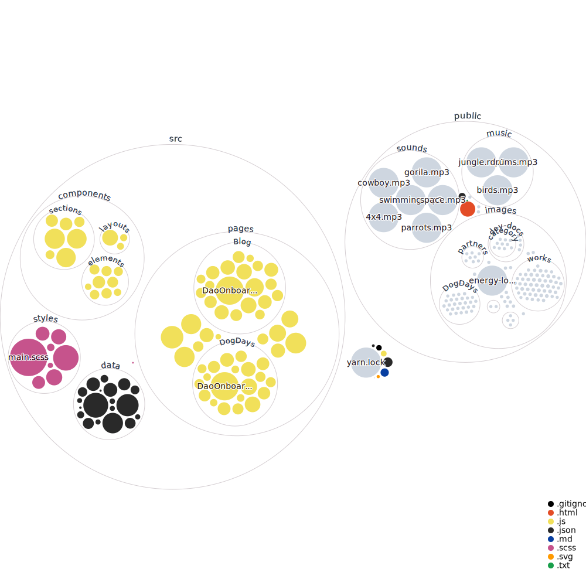

# pulsarforge-playing-field

  * Home crafter & gardener.
  * Building and Scaling Platforms.

Extra day to day activities
  * Writing articles and creating video content.
  * Freelancing:
    * User experience consulting.
    * Web development.
    * Integrations & deployments.
  * Reading books on different topics.

 
## Web3 Labs links:

[Home & Garden](https://pulsarforge.io/)

[Developer Docs](https://main.pulsarforge.io/)

## Get a sneak peek

## Repository visualization

